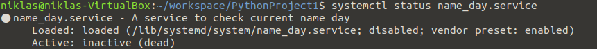

# Loggbok
## Tjänster i Linux
Som jag nämnde i min inlämningsuppgift 2 så finns det några stycken, tänkte att jag tar och går djupare in på dom. 
- Systemd, kontrollerar bakomliggande deamons, vilket man kan säga är som Unix liknande system som körs i bakgrunden utan att man direkt märker det, deamons väntar på kommandon från specifika händelser. Så Systemd hanterar dessa. 
- init, i inlämningen förklarade jag init som föregångaren till systemd, när jag söker information så hittar jag på fler ställen än ett att init är föräldern till alla processer, den skapar processer från skript som finns i filer. Init sätts igång av kärnan när systemet startas. 
- Mariadb, är en MySQL server hanterings system.
- httpd, står för "HyperText Transfer Protocol", tanken är att det skall köras som en ensam daemon process, när den används som tanken var så skapar den små processer som skall hantera nya begär. Rent generellt så startar man inte httpd direkt, utan den startar via apachectl (front end för httpd) på Unix baserade system. 
- firewalld, är en zon baserad brandvägg, där varje zon kan justeras så dom kan acceptera och neka vissa tjänster och porter, zoner kan också accosieras med ett eller flera nätverk. 
- libvirtd, är en öppen API, vilket betyder om jag har förstått det rätt att hantering och deamon verktyg för plattforms virtualisering, som tex Xen, QEMU och KVM för några. 

###Hur jag har tänkt
Jag valde att skriva en kod som en gång i timmen uppdaterar sig.
Koden hämtar dagens namnsdag från: 'https://sholiday.faboul.se/dagar/v2.1/', ur payloaden så plockas följande ut: datum, namn på dag och veckonummer.

Förflyttar servicen till systemd

Kollar statusen på servicen

Startar servicen och kollar så att den är aktiv

Visar vad servicen printar ut

Anledningen till att det står niklas@niklas är för att jag har tagit bort mina Linux maskiner så jag kan inte köra koden själv, men det är min kod som Niklas kör på sin maskin. Detta var godkänt av Sebastian. 

